# Food Mesh - Recipe Website

<p align="center">
  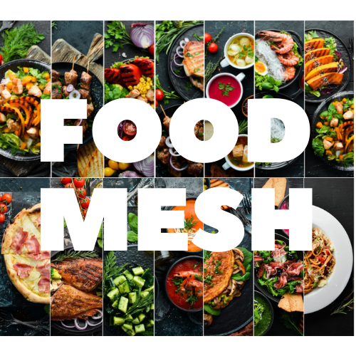
</p>

<p align="center">
  A recipe and food sharing website developed with ASP.NET MVC.
</p>

---

## Table of Contents

- [Project Overview](#project-overview)
- [Project Goals](#project-goals)
- [Features](#features)
- [Technologies Used](#technologies-used)
- [Application Architecture](#application-architecture)
- [Main Components](#main-components)
- [User Features](#user-features)
- [Admin Features](#admin-features)
- [Recipe and Food Content](#recipe-and-food-content)
- [Validation and Data Management](#validation-and-data-management)
- [Project Structure](#project-structure)
- [Screenshots](#screenshots)
- [Installation and Setup](#installation-and-setup)
- [How to Run](#how-to-run)
- [Dependencies](#dependencies)
- [Future Improvements](#future-improvements)
- [Author](#author)
- [License](#license)

---

## Project Overview

**Food Mesh** is a recipe and food sharing website developed using **C# and ASP.NET MVC**.

This project was developed as a web application project to practice building a structured MVC application with separate layers for business logic, entities, controllers, views, validation, and user roles.

The website focuses on food and recipe content and provides users with an organized platform for exploring recipes, food categories, authors, and other food-related content.

The project follows the **Model-View-Controller (MVC)** architecture and uses **Entity Framework** for database operations.

---

## Project Goals

The main goals of this project are:

- Building a complete web application using ASP.NET MVC
- Practicing the MVC architectural pattern
- Working with Entity Framework
- Separating business logic from presentation logic
- Managing users and roles
- Creating an organized and maintainable application structure
- Designing a responsive user interface
- Implementing data validation
- Working with recipe and food-related content
- Practicing database-driven web application development

---

## Features

### Recipe Management

- Recipe listing
- Recipe detail pages
- Recipe-related content management
- Food images
- Food categories
- Recipe information

### User Management

- User-related functionality
- User profiles
- Author information
- Role-based access

### Content Management

- Food categories
- Recipe content
- Author information
- Images and visual content
- Structured content pages

### User Interface

- Responsive web interface
- Bootstrap-based design
- Navigation components
- Food and recipe image presentation
- Structured MVC views

---

## Technologies Used

### Backend

- C#
- ASP.NET MVC 5
- .NET Framework 4.7.2
- Entity Framework 6
- FluentValidation

### Frontend

- HTML5
- CSS3
- JavaScript
- Bootstrap
- jQuery

### Additional Libraries

- Newtonsoft.Json
- PagedList
- PagedList.Mvc
- Microsoft ASP.NET Razor
- Microsoft ASP.NET WebPages
- ASP.NET Web Optimization

---

## Application Architecture

The project follows the **Model-View-Controller (MVC)** architecture.

The application is organized into separate layers to keep different responsibilities independent and make the project easier to maintain.

### Presentation Layer

Responsible for handling user interaction and displaying application pages.

Main components:

- Controllers
- Views
- Models

### Business Layer

Responsible for application business logic and operations.

The `BusinessLayer` contains the logic used by different parts of the application.

### Entity Layer

Responsible for defining the application's entities and data models.

The `EntityLayer` contains the entity classes used throughout the application.

### Data Access

**Entity Framework** is used for database operations and object-relational mapping.

---

## Main Components

### Controllers

The `Controllers` folder contains controllers responsible for handling HTTP requests and coordinating application operations.

### Views

The `Views` folder contains Razor views used to generate the application's user interface.

### Models

The `Models` folder contains models used by the presentation layer.

### BusinessLayer

The `BusinessLayer` folder contains business logic and application operations.

### EntityLayer

The `EntityLayer` folder contains the application's entity classes.

### Roles

The `Roles` folder contains functionality related to user roles and access control.

### Content

The `Content` folder contains CSS and other frontend resources.

### Scripts

The `Scripts` folder contains JavaScript libraries and frontend scripts.

### Images

The `images` folder contains the visual assets used throughout the website, including food images, logos, backgrounds, profile images, and other graphics.

---

## User Features

Users can interact with the website through the recipe and food content available throughout the application.

The project provides functionality for:

- Browsing food content
- Viewing recipes
- Viewing recipe details
- Exploring food categories
- Viewing author information
- Accessing user-related sections
- Viewing food and recipe images

---

## Admin Features

The application includes administrative and role-based functionality.

Administrative functionality supports content and user management within the application.

Role-based access helps separate regular user operations from administrative operations.

---

## Recipe and Food Content

Food and recipe content is supported by a collection of visual assets stored in the `images` directory.

The image collection includes:

- Food category images
- Recipe images
- Background images
- Logo and branding assets
- Author and profile images
- Other website graphics

The repository includes food and recipe images such as:

- Beef Wellington
- Steak
- Tiramisu
- Chicken dishes
- Pasta
- Desserts
- Soups
- Salads
- Breakfast dishes
- Traditional and regional foods

---

## Validation and Data Management

The project uses **FluentValidation** for data validation and **Entity Framework** for database operations.

FluentValidation helps ensure that user-entered data follows the required validation rules.

Entity Framework provides database interaction and allows database records to be represented as .NET objects.

The project uses a layered structure to separate:

- Presentation logic
- Business logic
- Entity definitions
- Data access operations

This approach improves code organization and maintainability.

---

## Project Structure

```text
Food_Recipe_Site/
│
├── App_Start/
├── BusinessLayer/
├── Content/
├── Controllers/
├── EntityLayer/
├── Models/
├── Properties/
├── Roles/
├── Scripts/
├── Views/
├── images/
├── packages/
│
├── Global.asax
├── Global.asax.cs
├── MvcProje.csproj
├── MvcProje.sln
├── Web.config
├── Web.Debug.config
├── Web.Release.config
├── packages.config
└── README.md
```
---

## Screenshots

### Headings

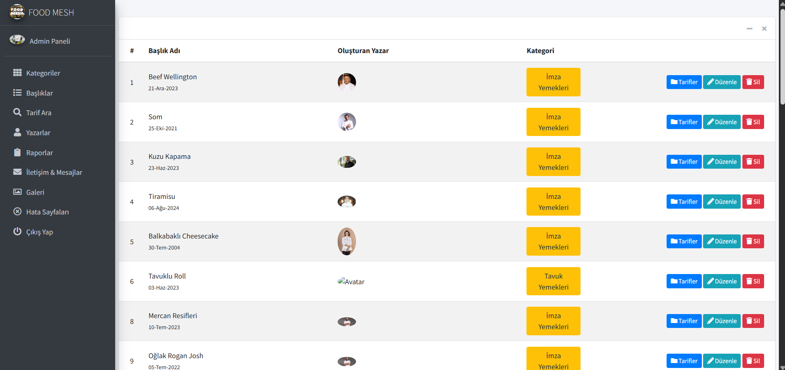

### Categories

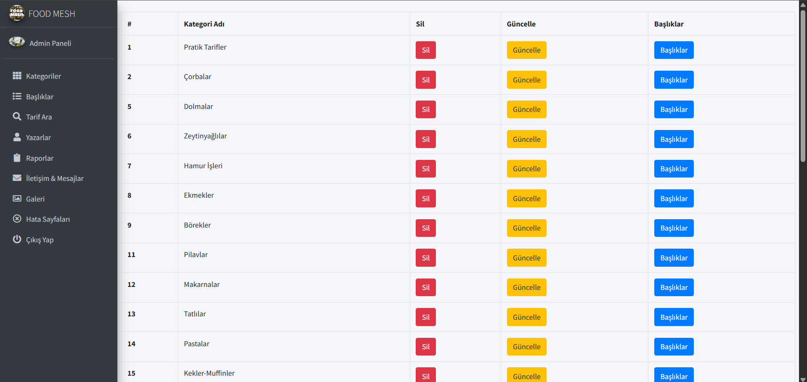

### Recipe Search

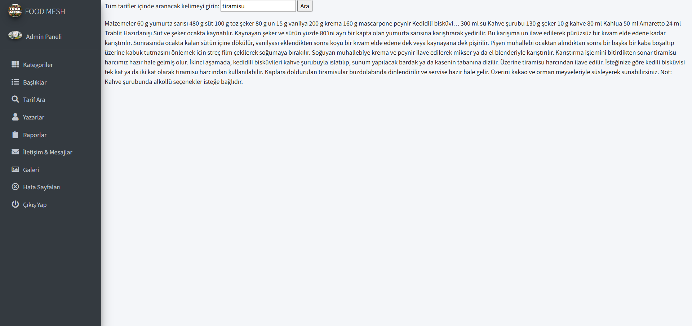

### Reports

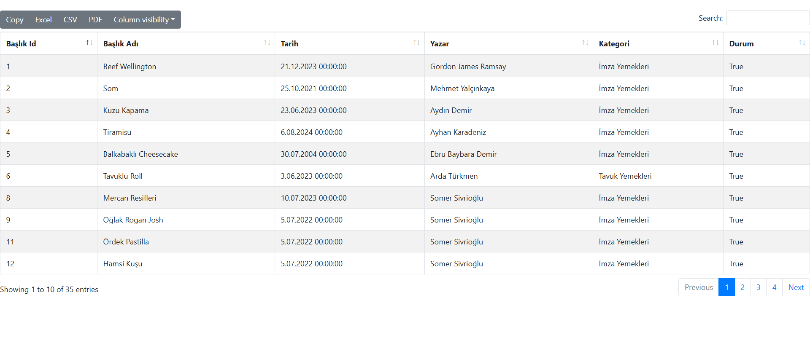

### Contact Messages

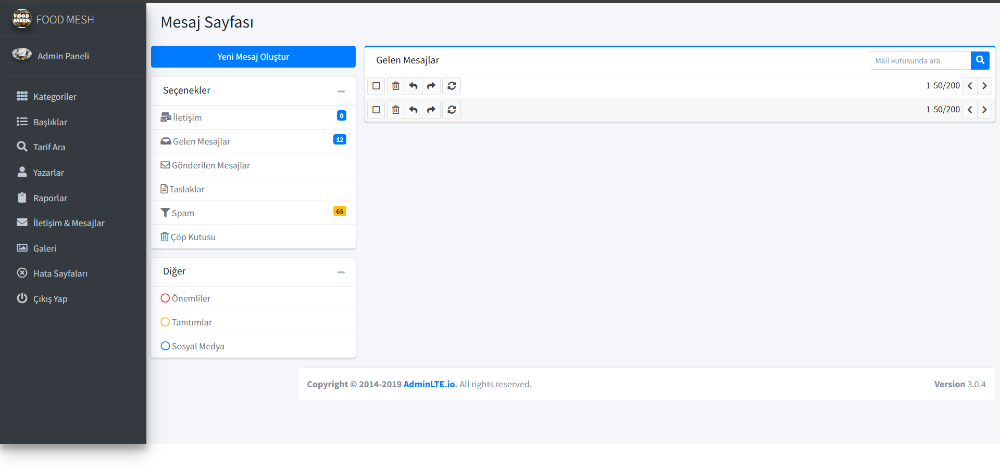

### Writers

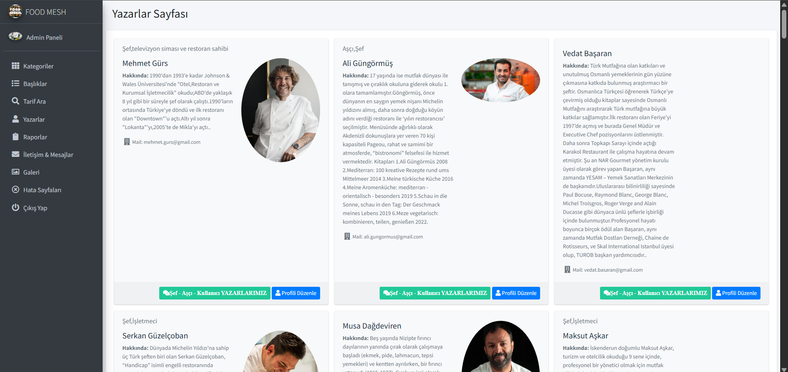

### Gallery

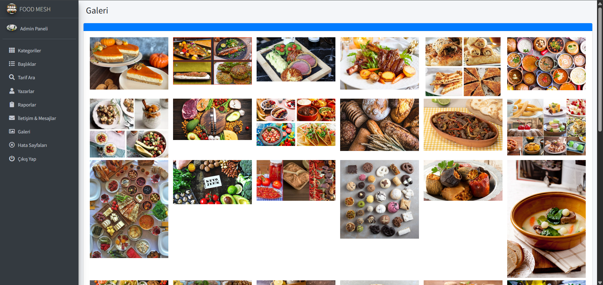

### Writer Login

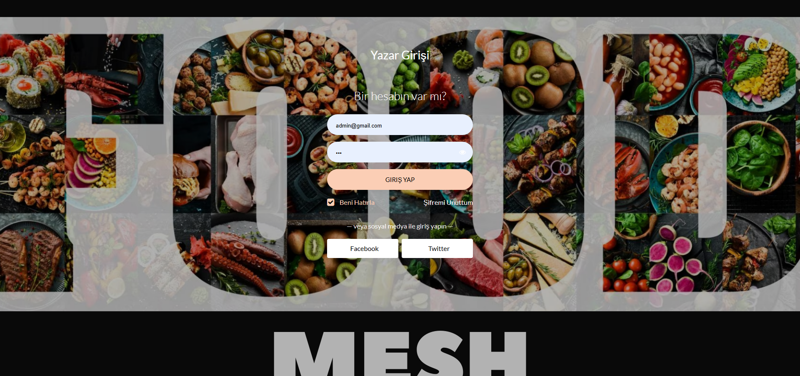

### Writer Profile

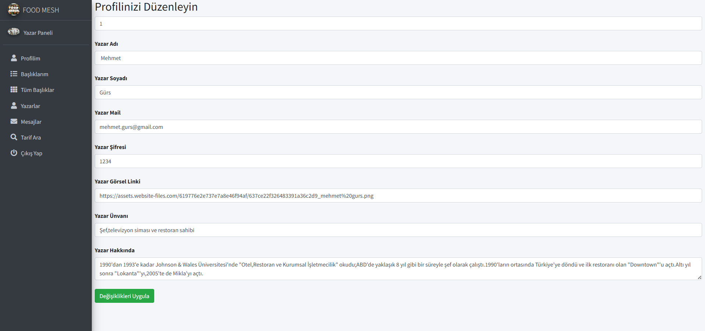

### Writer Headings

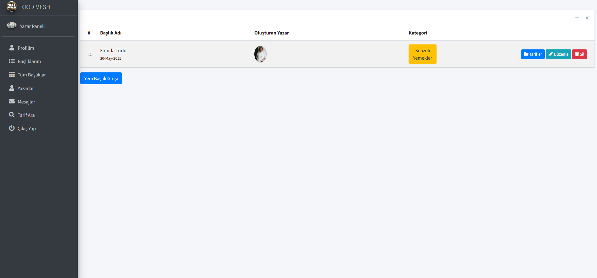

### All Headings

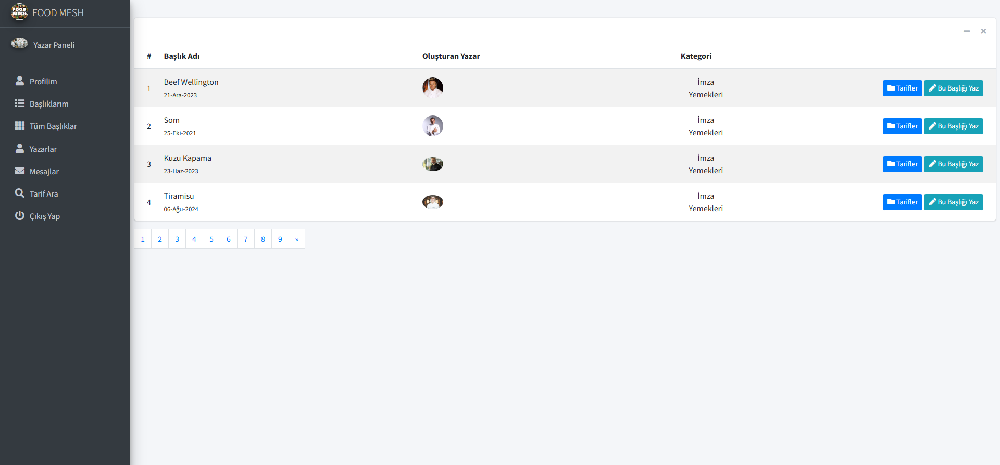

---


## Installation and Setup

### 1. Clone the Repository

    git clone https://github.com/dilberkrtl/Food_Recipe_Site.git

### 2. Navigate to the Project Directory

    cd Food_Recipe_Site

### 3. Open the Solution

Open the following solution file using **Visual Studio**:

    MvcProje.sln

### 4. Restore NuGet Packages

The project dependencies are defined in:

    packages.config

Restore the required NuGet packages using Visual Studio.

### 5. Configure the Database

Before running the application, check the database connection settings in:

    Web.config

Update the connection string according to your local database configuration.

### 6. Build the Project

In Visual Studio, select:

    Build → Build Solution

or use:

    Ctrl + Shift + B

---

## How to Run

After restoring the NuGet packages and configuring the database:

1. Open `MvcProje.sln` in Visual Studio.
2. Restore the NuGet packages.
3. Check the database connection settings.
4. Build the solution.
5. Set the web project as the startup project if necessary.
6. Run the application using **F5** or **Ctrl + F5**.

The application will open using the configured local development server.

---

## Dependencies

The main NuGet packages used in the project include:

| Package | Version |
|---|---|
| ASP.NET MVC | 5.2.9 |
| Entity Framework | 6.4.4 |
| Bootstrap | 5.2.3 |
| FluentValidation | 11.5.2 |
| jQuery | 3.4.1 |
| jQuery Validation | 1.17.0 |
| Newtonsoft.Json | 12.0.2 |
| PagedList | 1.17.0.0 |
| PagedList.Mvc | 4.5.0.0 |
| ASP.NET Razor | 3.2.9 |
| ASP.NET WebPages | 3.2.9 |
| ASP.NET Web Optimization | 1.1.3 |
| Modernizr | 2.8.3 |

The complete dependency list is available in:

    packages.config

---

## Future Improvements

Possible future improvements include:

- Advanced recipe search and filtering
- Recipe favorites
- User comments and ratings
- Improved authentication and authorization
- Advanced admin dashboard
- Improved image management
- Additional recipe categories
- Database performance improvements
- Automated testing
- Production deployment
- Improved responsive design
- Additional user interaction features

---

## Author

**Dilber Kartal**

Food Mesh - Recipe Website

Developed with:

- C#
- ASP.NET MVC
- Entity Framework
- Bootstrap
- JavaScript
- jQuery

---

## License

This project was developed as a personal web development project for educational and portfolio purposes.
